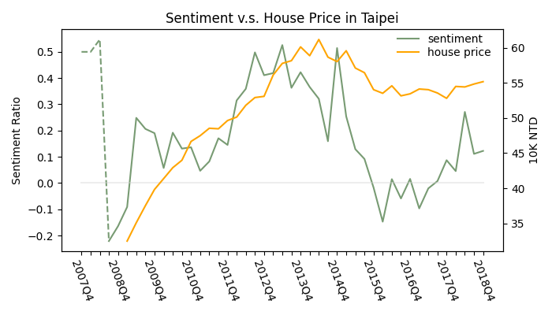

# House_market_sentiment_analysis

This project involves analyzing sentiment in the Taiwanese house market using data collected from one of the largest online forums in Taiwan, [Mobile01](https://www.mobile01.com/).<br>

The project is divided into four parts:
1. Scrape discussion threads from Mobile01.
2. Pre-train a word2vector model for generating word2vec features.
3. Train an autoML xgboost classifier to predict public sentiment in the Taiwanese house market.
4. Evaluate results.

<br>
<br>

## 1. Scrape discussion threads from Mobile01
I utilize `web_scraper.py` to extract threads from Mobile01. This process involves using tools such as [Selenium](https://www.selenium.dev/) and [undetected driver](https://github.com/ultrafunkamsterdam/undetected-chromedriver) for web scraping, and [BeautifulSoup](https://www.crummy.com/software/BeautifulSoup/) for parsing the results. Prior to running the script, ensure you have these tools available. __It's worth noting that changes in Mobile01's website structure may lead to issues or unexpected results__. If you encounter any problems, please inform me.

<br>

There are 6 arguments within the web_scraper function:

1. `county`: Specify the county forum you want to parse since Mobile01 has specific forums for different counties. Refer to util_scraper/config.yaml for a list of county forums on Mobile01.
2. `run`: Choose from 4 function types: `scrape_end2end`, `scrape_topic_summary`, `scrape_topic_by_urls`, and `scrape_topic`.
    - `scrape_end2end`: This involves 2 steps:
        1. Scraping all topics in the country forum and creating a table with topics and their corresponding URLs, leading to sub-discussion threads.
        2. Extracting sub-discussion threads from topic URLs obtained in step 1.
    - `scrape_topic_summary`: Performs only the first part of `scrape_end2end`, which involves scraping topics and their sub-discussion URLs. You can specify `topic_summary` to save the parsed results.
    - `scrape_topic_by_urls`: Executes the second part of `scrape_end2end`, focusing on sub-discussion threads by visiting topic URLs. You can specify `topic_summary` (containing topic and URL information) and `topic_content` to save the scraped results.
    -  `scrape_topic`: Scrapes sub-discussion threads of a specific topic. You need to provide the topic's URL.

3. `topic_summary`: Specify the file to parse topic summaries or to save scraped results. If set to `None`, `scrape_topic_by_urls` and `scrape_topic_summary` will read/write files in the latest __result/scraped_result/`county_code`/topic_summary_yyyymmdd.pkl__ location. Refer to util_scraper/config.yaml for county codes.
4. `final_page`: For `scrape_topic_summary`, scraping occurs from the last page to the first. You can specify a starting page for the function.
5. `topic_content`: Specify the file to store scraped results of sub-discussion threads. If set to `None`, scrape_topic_by_urls will write files in the latest __result/scraped_result/`county_code`/topic_content_yyyymmdd.pkl__ location. Refer to util_scraper/config.yaml for county codes.
6. `start_page`: For `scrape_topic_by_urls`, scraping starts from the first page to the last. You can specify a starting page for the function.

<br>
<br>

## 2. Pre-train a word2Vector model

In `train_word2vec.py`, there are 2 main steps:

1. Text Cleaning and Sentence Segementation using [`jieba`](https://github.com/fxsjy/jieba)
2. Word2Vec Model Training using [`Gensim`](https://radimrehurek.com/gensim/index.html)

Before running the script, please ensure that you have these tools available. Also, the model file and training data are not uploaded due to their large sizes.
<br>

### __Text Cleaning and Word Segmentation__

For improved performance, several steps are implemented before the final word segmentation:

1. Text Cleaning 

    - Correct frequent misspelled words, transform halfwidth forms to fullwidth forms, and convert simplified forms to traditional forms. Refer to `util_text_cleaner/config.yaml` for more details.
    - Replace names with spaces. In Taiwanese online forums, users often refer to each other as "大大", "A大", "L大", etc., which can cause segmentation errors. To address this, I replace these names with spaces. Refer to `util_text_cleaner/config.yaml` for more details.
    - Replace symbols other than "!" and "?" with spaces.
    
2. Self-Defined Dictionary for Taiwanese House Market:

    - To improve sentence segmentation accuracy, I've added new terms to a self-defined dictionary after reviewing default segmentation results repeatedly. Please refer to `util_text_cleaner/add_words.txt` for the self-defined dictionary and `util_text_cleaner/dict.txt` for the Jieba default dictionary.

<br>

### __Word2Vec Model Training__

After performing Jieba word segmentation, I train a word embedding model that converts each term into a `300-dimensional` vector. Word embedding is a technique that maps terms to real-number vectors. I employ [Word2vector](https://en.wikipedia.org/wiki/Word2vec) to accomplish this, which is a neural network model that considers multiple corpora and uses the term and its surrounding context terms to create a high-dimensional vector. Terms with similar meanings tend to be located closely in this vector space.

To train a suitable Word2Vec model for public sentiment related to the housing market, I use 2M+ text data, including all posts from the Mobile01 real estate discussion boards and housing market news from [UDN (聯合新聞網)](https://house.udn.com/house/index). The gensim package is utilized to train a Continuous Bag of Words (CBOW) Word2Vec model in this project. 

<br>

### __Training result__

Examples of similar words:

For `彭淮南` (Former central bank president in Taiwan):
```
# encoding=utf-8

from gensim.models import Word2Vec
model300 = Word2Vec.load("result/word2vec_result/word2vec.model300")

model300.wv.most_similar('彭淮南', topn=3) 
```
Output
```
[('彭總裁', 0.7710217237472534),
 ('央行', 0.729074239730835),
 ('張盛和', 0.7097881436347961),
 ('財政部長', 0.6743882894515991),
 ('中央銀行', 0.6690319180488586)]
```

<br>

For `房價` (House price):
```
model300.wv.most_similar('房價', topn=5)
```
Output
```
[('屋價', 0.7838715314865112),
 ('房地價', 0.6767888069152832),
 ('土地價格', 0.6736090779304504),
 ('房市', 0.672882616519928),
 ('物價', 0.6563156247138977)]
```

<br>

For `看衰` (Depreciation anticipation):
```
model300.wv.most_similar('看衰', topn=5)
```
Output
```
[('唱衰', 0.8339731693267822),
 ('看壞', 0.798155665397644),
 ('看空', 0.7457432746887207),
 ('唱雖', 0.7350273728370667),
 ('唱空', 0.6866986155509949)]
```

<br>

For `飆漲` (Appreciation anticipation):
```
model300.wv.most_similar('飆漲', topn=5)
``` 
Output
```
[('飛漲', 0.8241196870803833),
 ('狂飆', 0.7983549237251282),
 ('飆升', 0.7962146997451782),
 ('上漲', 0.7787458300590515),
 ('狂漲', 0.769774854183197)]
```
<br>
<br>

## 3. Train an autoML xgboost classifier to predict public sentiment in the Taiwanese house market
In `train_xgb.py`, I employ an XGBoost classifier with hyperparameter tuning using Hyperopt to construct an automated machine learning (AutoML) model for predicting the sentiment of posts in the house market. The script consists of 2 main parts: 

1. Preprocess
2. Model Training 

Before running the script, please ensure that you have [`scikit-learn`](https://scikit-learn.org/stable/index.html), [`xgboost`](https://xgboost.readthedocs.io/en/stable/#),  [`hyperopt`](http://hyperopt.github.io/hyperopt/) available. Also, the model file and training data are not uploaded due to their large sizes.

<br>

### __Preprocess__ 

The preprocessing stage involves 2 primary steps, resulting in a total of 3300 features before entering the model.

1. __300 Word2vec feature__: As previously mentioned, I generate a 300-dimensional vector for each term. Consequently, each post is represented by a n * 300 vector after the word2vec transformation. These vectors are then averaged along each dimension to produce a 1 * 300 vector for each post. Additionally, the 300 Word2Vec features are standardized based on the training set.

2. __3000 K-Best Features__: I utilize the N-gram technique and chi-square feature selection to generate 3000 K-best features.

    - Each post is segmented using the 1-5 gram method. ([N-gram](https://en.wikipedia.org/wiki/N-gram) involves segmenting sentences based on the sequential relationships between words. For instance, a 2-gram (bigram) technique divides a sentence into pairs of adjacent words.)
    - I employ [chi-square feature selection](https://scikit-learn.org/stable/modules/generated/sklearn.feature_selection.chi2.html) to select the 3000 most informative terms. For each selected term, a binary feature is generated, which takes the value 1 if a post contains the term and 0 otherwise.

<br>

### __Model Training__
In this section, I build an XGBoost classifier using Hyperopt for hyperparameter tuning and cross-validation. 

<br>

The `OptimizedXGB` class can be created with a `custom_params_space` parameter, which allows setting a custom tuning parameter space. If set to `None`, a default parameter space is utilized. Refer to `util_model/model_helper.py` for more details.

When calling the `fit` function, you can set cv = StratifiedKFold to use a pre-defined cross-validation set or set cv = (0, 1) for OptimizedXGB to split the training set using `train_test_split`.

<br>

### __Training Result__

F1 score and Accuracy

```
from sklearn.metrics import f1_score, confusion_matrix

f1 = f1_score(y_test, y_pred, average = 'weighted')
accu = f1_score(y_test, y_pred, average = 'micro')
print(f'f1 : {f1}')
print(f'accuracy : {accu}')
```

Output
```
f1 : 0.7195948622900562
accuracy : 0.7237087741132545
```

<br>

Confusion Matrix

```
cm = confusion_matrix(y_test, y_pred)
cm
```

Output

```
array([[251, 114,  36],
       [ 67, 671,  61],
       [ 64, 102, 241]])
```

The model achieves a weighted F1 score of 0.72 and an accuracy of 0.72.

<br>

Negative sentiment prediction:
```
test[y_pred == 0].sample(1)['content'].values
```

Output

```
array(['千萬不要買台灣房地產已經負成長了高雄又是人口負成長的前段班有錢人再撐沒錢人也在撐如果不是急著買屋真的不急用薪水來買現在的屋是最笨的現在薪水那麼低年輕人大部分都是沒能力購屋的一群買下去等著跌而已不是自己的錢不怕跌的就買而已'],
      dtype=object)
```

<br>

Positive sentiment prediction:
```
test[y_pred == 2].sample(1)['content'].values
```

Output

```
array([' 昨天開車去康橋周邊和龜山區的新重劃區繞了一圈，康橋鷹架已經全部拆除，正在整四周的退縮部分，已接近完工。Morrison 則剛剛架起第一棟的鋼構，順道去看一下一戶9000萬的別墅，外觀特別。A7周圍重劃區，靠文化一路左邊架起不少建案的大型廣告看板和接待中心，右邊則是幾家公司總部正在整地施工，中華郵政那塊地大的不像話，區域還沒有看過單一開案發地那麼大的。整個A7周邊看起來氣氛熱絡，未來榮景可期  '],
      dtype=object)
```

<br>


## 4. Evaluate results

In this section, I compute sentiment ratios for different quarters, where <br>
$$\text{Sentiment Ratio} = \frac{\text{Positive Sentiment} - \text{Negative Sentiment}}{\text{Positive Sentiment} + \text{Negative Sentiment}}$$, is obtained by comparing positive to negative sentiment counts.

Subsequently, I correlate these sentiment ratios with house prices in Taipei from 2009 to 2018. The house price data is sourced from [Sinyi Realty (信義房屋)](https://www.sinyinews.com.tw/quarterly?sinyisid=MjAyMzA4MTQxMTMxNTAzMTg=), which specifically focuses on residential property transactions. It provides one of the most representive house price index in Taiwan.

<br>


This figure shows housing prices and sentiments in Taipei between 2008 and 2018. <br> <br>

Before 2015, the public sentiments were largely positive. However, between 2015 and 2016, the morale of the housing market started slumping. This pessimistic sentiment persisted until late 2017. At first glance, the patterns of the house prices and the sentiments seem correlated. The house prices grew exponentially before 2014 but have stagnated since 2014. __This apparent alignment suggests a potential relationship between house prices and public sentiments in Taipei.__ However, a more rigorous examination still has to be done to make any further causal inferences.

<br>

Please refer `Sentiment_Prediction.ipynb` for more details.
